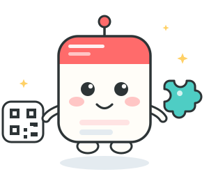
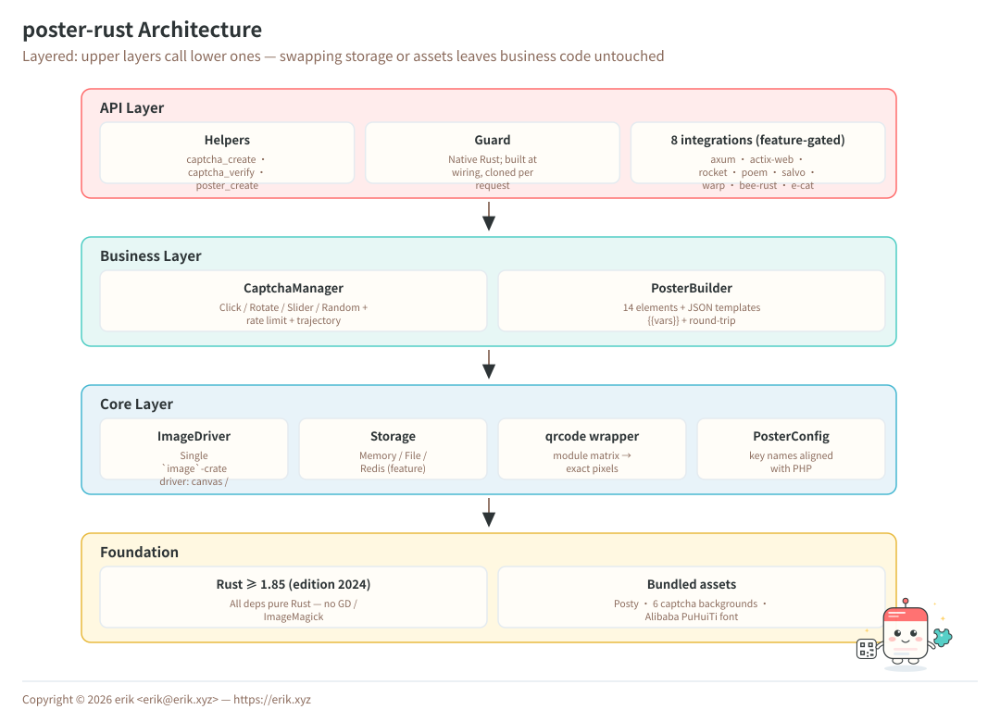
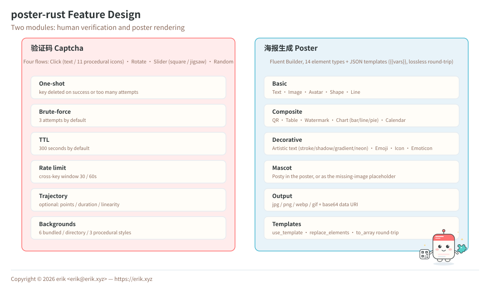
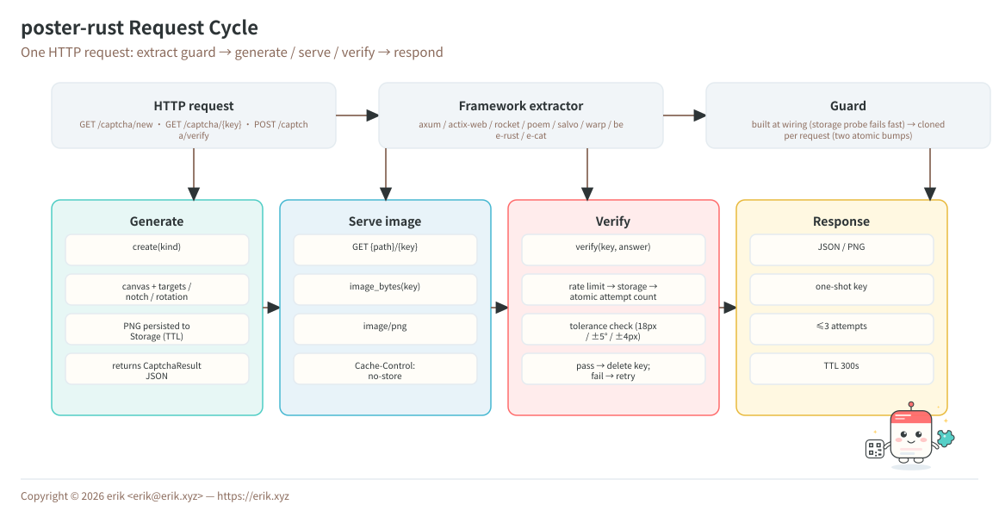
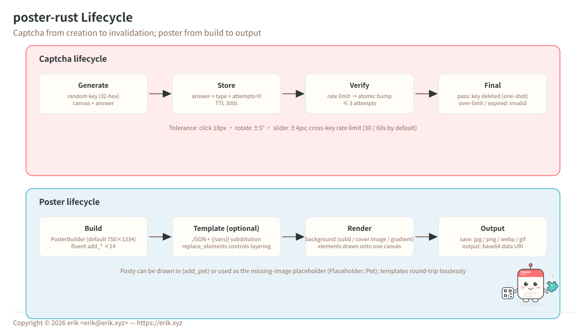

# poster-rust

[](https://crates.io/crates/poster-rust)
[](https://docs.rs/poster-rust)
[](LICENSE)
[](https://github.com/erikwang2013/poster-rust/actions/workflows/ci.yml)

<p align="center">
  
</p>

Rust image captcha & poster generation toolkit — framework-agnostic core + a native Guard + axum / actix-web / rocket / poem / salvo / warp / bee-rust / e-cat integrations.

[中文文档](README.md) | [Architecture](docs/architecture.md)

## Overview

poster-rust is a Rust image toolkit that does two things, and does them well:

| Capability | Description |
|------------|-------------|
| **Captcha** | Click / rotate / slider human verification plus a random mode — images and answers generated in pure Rust, no third-party service |
| **Poster generation** | Fluent Builder API with 14 element types covering text, images, QR codes, tables, charts and calendars |
| **Framework-agnostic** | Zero framework dependencies in the core (pure Rust image stack, no system libraries) |
| **Batteries included** | 3 helper functions + a native Guard + 8 framework integrations (feature-gated) |
| **Swappable** | Storage backends (Memory / File / Redis) are trait implementations |

> Project mascot **Posty** — a poster body carrying a QR card and a slider puzzle, matching the two sides of the package: rendering and verification. It ships with the package ([`assets/pet.svg`](assets/pet.svg) / [`assets/pet.png`](assets/pet.png)): draw it with `add_pet()`, or set it as the placeholder for missing images.

## Project Structure

```
poster-rust/
├── src/                        # 51 files / ~8,900 lines
│   ├── lib.rs                  # Exports + helpers (captcha_create / captcha_verify / poster_create)
│   ├── captcha/                # 4 types + factory + manager + rate limiter + trajectory
│   │   ├── click.rs            #   Click (text / 11 procedural icon targets)
│   │   ├── rotate.rs           #   Rotate (±5° tolerance, circular shortest-arc)
│   │   ├── slider.rs           #   Slider (square / jigsaw, ported line-by-line from PHP)
│   │   └── manager.rs          #   CaptchaManager: generate / verify / serve (Send + Sync)
│   ├── poster/                 # Builder + Template + 14 element renderers
│   ├── drivers/                # Canvas (image crate) / TTF text (ab_glyph) / color
│   ├── storage/                # Memory / File (atomic writes) / Redis (feature)
│   ├── integrations/           # axum / actix / rocket / poem / salvo / warp / bee_rust / ecat
│   ├── guard.rs                # Native Guard (framework-agnostic, fails fast at wiring)
│   ├── qrcode.rs               # QR codes (qrcode crate, exact pixel size)
│   ├── config.rs               # Config (key names aligned with PHP's config/poster.php)
│   ├── mascot.rs               # Mascot Posty: NAME / TAGLINE / art() / greet()
│   └── assets.rs               # Bundled: mascot / 6 backgrounds / default font
├── assets/                     # pet.svg (README + docs icon) / pet.png / backgrounds / fonts
├── tests/                      # 8 suites / 147 cases, mirroring src/
├── examples/                   # 9 runnable examples (incl. axum / actix servers, social preview)
├── scripts/                    # gen-diagrams.py: builds the zh/en SVG diagrams
└── docs/                       # SVG diagrams (zh+en) / architecture.md / social preview / donate codes
```

## Architecture & Design

Layered dependencies: upper layers call lower ones — swapping storage or assets leaves business code untouched.

### System Architecture



### Feature Design



### Request Cycle



### Lifecycle



> Diagrams are generated by `scripts/gen-diagrams.py` (Chinese + English sets, each embedding the mascot Posty and the copyright).

## Features

poster-rust ships 3 helper functions, a native Guard and 8 framework integrations; the core has zero framework
dependencies and everything is feature-gated (`axum` / `actix` / `rocket` / `poem` / `salvo` / `warp` / `bee-rust` / `ecat` / `redis`).

### Captcha (three methods + random switch)

| Type | Description |
|------|-------------|
| Click `click` | User clicks image targets in order (text or procedural icons) |
| Rotate `rotate` | User drags a slider to rotate the image back |
| Slider `slider` | User drags a puzzle piece into the notch (square / jigsaw outline) |
| Random `random` | Randomly picks one of the three |

### Poster generation

Fluent Builder API with 14 element types:

| Element | Method | Description |
|---------|--------|-------------|
| Text | `add_text()` | Auto wrap, alignment, multi-line, rotation |
| Image | `add_image()` | Scaling, rounded corners, shadow |
| Avatar | `add_avatar()` | Circular crop, border |
| QR code | `add_qrcode()` | Pure Rust, center logo, caption |
| Shape | `add_shape()` | Rect/circle, fill/stroke, radius, opacity |
| Line | `add_line()` | Color, width |
| Watermark | `add_watermark()` | Tiled text, angle, spacing |
| Table | `add_table()` | Header, zebra stripes, column widths |
| Chart | `add_chart()` | Bar / line / pie |
| Calendar | `add_calendar()` | Monthly grid, highlights, notes |
| Artistic text | `add_artistic_text()` | Stroke / shadow / gradient / neon |
| Emoji | `add_emoji()` | Color emoji rendering |
| Icon | `add_icon()` | FontAwesome icon rendering |
| Emoticon | `add_emoticon()` | Japanese kaomoji / custom |
| Mascot | `add_pet()` | Draw Posty into the poster |

## Installation

```bash
cargo add poster-rust
```

Requires Rust ≥ 1.85 (edition 2024). All dependencies are pure Rust — no GD / ImageMagick or other system libraries.

Optional features:

| feature | Description |
|---------|-------------|
| `axum` / `actix` / `rocket` / `poem` / `salvo` / `warp` | Framework integration (extractor + image routes) |
| `bee-rust` | bee-rust integration (implies `axum`, `bee_router`) |
| `ecat` | e-cat integration (implies `axum`) |
| `redis` | Redis captcha storage (distributed deployments) |

```toml
[dependencies]
poster-rust = { version = "1.0", features = ["axum", "redis"] }
```

## Usage

### 1. Captcha

```rust
use poster::captcha::{Answer, CaptchaManager};

let manager = CaptchaManager::new()?;

// Click captcha
let result = manager.create(Some("click"))?
    .set_difficulty("hard")               // easy(2 targets) | medium(3) | hard(4)
    .set_background("/path/to/bg.jpg")    // optional custom background
    .generate()?;
// result.key    → opaque key, hand it to the frontend
// result.image  → data:image/png;base64,… image
// result.extra  → { "texts": [ { "order": 1, "text": "合" }, … ] }
let pass = manager.verify(&result.key, Answer::Click(vec![
    (120.0, 80.0), (200.0, 150.0), (310.0, 95.0),
]))?;   // 18px tolerance radius

// Rotate captcha
let result = manager.create(Some("rotate"))?.set_size(200).generate()?;
let pass = manager.verify(&result.key, Answer::Rotate(185.0))?;   // ±5°

// Slider captcha
let result = manager.create(Some("slider"))?.set_shape("jigsaw").generate()?;
// result.extra → { "puzzle": "data:image/png;base64,…", "puzzle_w": 50, "puzzle_h": 50 }
let pass = manager.verify(&result.key, Answer::Slider(173.0))?;   // ±4px

// Random
let result = manager.create(Some("random"))?.generate()?;
// result.captcha_type is the actual type: "click" | "rotate" | "slider"
```

#### Security

| Feature | Description |
|---------|-------------|
| One-shot | Key is deleted after success or too many attempts |
| Brute-force guard | 3 attempts max by default |
| TTL | 300 seconds by default |
| Randomness | Background, noise and target positions are randomized |
| Rate limit | Cross-key window limit (30 verifications / 60s by default) |
| Trajectory | Optional (off by default): point count / duration / linearity |
| Backgrounds | 6 bundled backgrounds, or procedural gradients (3 styles) |

### 2. Poster generation

```rust
use poster::PosterBuilder;
use poster::poster::builder::Direction;
use poster::poster::elements::{image::ImageElement, qrcode::QrcodeElement, text::TextElement};
use poster::drivers::{OverlayOptions, TextOptions};

let mut builder = PosterBuilder::new()?;   // default 750×1334
builder.background("#FFFFFF");                                 // solid color
builder.background("/path/to/bg.jpg");                         // image (auto-scaled)
builder.background_gradient("#FF6B6B", "#FF8E53", Direction::Vertical);

builder.add_text("New Arrival", TextElement {
    x: 80, y: 120,
    // size is in points at 96dpi — same scale as PHP, templates port 1:1
    style: TextOptions { size: 48.0, color: "#333333".into(), ..Default::default() },
    ..Default::default()
});
builder.add_image("/path/to/product.jpg", ImageElement {
    x: 75, y: 280,
    style: OverlayOptions { width: Some(600), height: Some(600), radius: 12, ..Default::default() },
    ..Default::default()
});
builder.add_qrcode("https://example.com/page/123", QrcodeElement {
    x: 275, y: 1050, size: 200,
    level: "H".into(),
    label: Some("Scan for details".into()),
    ..Default::default()
});

builder.save("/output/poster.jpg", None)?;        // quality from config
let data_url = builder.output("png", Some(90))?;  // base64 data URL
```

#### Mascot `add_pet()`

```rust
use poster::poster::elements::image::ImageElement;

builder.add_pet(ImageElement { x: 555, y: 140, ..Default::default() });
// or grab the path yourself (e.g. as a QR center logo):
let logo = poster::assets::pet_path();
```

**Missing-image placeholder**: set `poster.placeholder` to `Placeholder::Pet` and missing images will be drawn as Posty instead of being skipped.

### 3. Template system

```rust
use poster::PosterTemplate;
use serde_json::json;

let template = PosterTemplate::from_config(json!({
    "width": 750, "height": 1334,
    "elements": [
        {"type": "shape", "shape": "rect", "color": "#FF6B6B", "x": 0, "y": 0, "width": 750, "height": 300},
        {"type": "text", "text": "{{title}}", "x": 80, "y": 100, "size": 48, "color": "#FFFFFF"},
        {"type": "image", "src": "{{cover}}", "x": 75, "y": 350, "width": 600, "height": 600, "radius": 12}
    ]
}))?;

builder.use_template(template)
    .with([("title", "New Arrival"), ("cover", "/path/to/product.jpg")])
    .save("/output/poster.jpg", None)?;
```

`use_template()` **replaces** previously added elements; pass `replace_elements(false)` to layer hand-written elements on top. `builder.to_array()` exports the current builder back into the same JSON structure.

## Framework integration

Every adapter produces a **`Guard`** request guard: built at wiring time, cloned per request (two atomic increments, `Send + Sync`).

```rust
use std::sync::Arc;
use poster::{Guard, captcha::CaptchaManager};

let guard = Guard::from_manager(Arc::new(CaptchaManager::new()?))?;  // fails fast (storage probe)
```

### axum

```rust
use axum::Router;
use poster::{Guard, integrations::axum::{GuardState, captcha_routes}};

#[derive(Clone)]
struct AppState { captcha: Guard }
impl GuardState for AppState {
    fn guard(&self) -> &Guard { &self.captcha }
}

let app: Router = Router::new()
    .merge(captcha_routes::<AppState>())   // GET /captcha/new · POST /captcha/verify · GET /captcha/{key}
    .with_state(AppState { captcha: guard });
```

### actix-web

```rust
use actix_web::{web, App, HttpServer};

HttpServer::new(move || {
    App::new()
        .app_data(web::Data::new(guard.clone()))
        .configure(poster::integrations::actix::configure)
})
```

### Rocket / Poem / Salvo / Warp / bee-rust / e-cat

Same `Guard`, per-framework extractors:

```toml
poster-rust = { version = "1.0", features = ["rocket"] }   # or poem / salvo / warp / bee-rust / ecat
```

Each integration ships a request guard extractor plus image routes (`GET {path}/{key} → image/png`, `Cache-Control: no-store`) matching the PHP version's `captcha.route`. Runnable examples: [`examples/`](examples/) (`axum_captcha` / `actix_captcha` / `guard_native`).

## Configuration

```rust
use poster::config::{self, PosterConfig};

let mut cfg = PosterConfig::default();
cfg.captcha.ttl_secs = 600;
config::set_global(cfg)?;
```

Key options (aligned with PHP's `config/poster.php`):

| Option | Default | Description |
|--------|---------|-------------|
| `captcha.default_type` | `random` | `click` / `rotate` / `slider` / `random` |
| `captcha.default_difficulty` | `medium` | `easy` / `medium` / `hard` |
| `captcha.slider_shape` | `square` | `square` / `jigsaw` |
| `captcha.click_words` | `[合,家,欢,…]` | Click captcha word pool |
| `captcha.background_source` | `Embedded` | `Embedded` (6 bundled) / `Dir(path)` / `Procedural` |
| `captcha.ttl_secs` | `300` | Captcha lifetime (seconds) |
| `captcha.max_attempts` | `3` | Max verification attempts |
| `captcha.tolerance` | `{click:18, rotate:5, slider:4}` | Per-type tolerance |
| `captcha.rate_limit` | `{max:30, window_secs:60}` | Window rate limit |
| `captcha.trajectory` | `{enabled:false, …}` | Interaction trajectory checks |
| `poster.default_width` / `default_height` | `750` / `1334` | Default canvas |
| `poster.placeholder` | `None` | `None` skip / `Pet` draw Posty / `Path(p)` |
| `poster.jpeg_quality` | `90` | Default JPEG quality |
| `poster.png_compression` | `6` | PNG compression level 0-9 |

## Differences from poster-php

poster-rust is a port of [poster-php](https://github.com/erikwang2013/poster-php); core capabilities map one-to-one, with these intentional differences:

| Area | poster-php | poster-rust |
|------|-----------|-------------|
| Image driver | GD / ImageMagick | Single pure Rust driver (`image` crate), no system deps |
| QR codes | Hand-written pure PHP generator | `qrcode` crate |
| Storage | File / Session / Redis / PSR-16 | Memory / File / Redis (Session is PHP-specific) |
| Framework adapters | Laravel / ThinkPHP / Webman / Hyperf / Yii2 / Yii3 | Guard + axum / actix-web / rocket / poem / salvo / warp / bee-rust / e-cat |
| Configuration | `config/poster.php` array | `PosterConfig` struct (same key names, serde-serializable) |
| Text `size` scale | `imagettftext` points at 96dpi (≈ ×4/3 px) | Same scale (auto-calibrated per font metrics) |
| Background image | Stretched to canvas | Cover-fit + center-crop (no distortion) |
| QR code size | `intval`-quantized to whole modules | Exact pixel size (fractional scaling) |
| Custom elements | Runtime class registration | 14 built-ins (enum dispatch) |
| Docs | 14 languages | Chinese + English |

## Support

| WeChat | Alipay |
|:---:|:---:|
|  |  |

---

## License

MIT License

Copyright © 2026 erik <erik@erik.xyz> — https://erik.xyz
