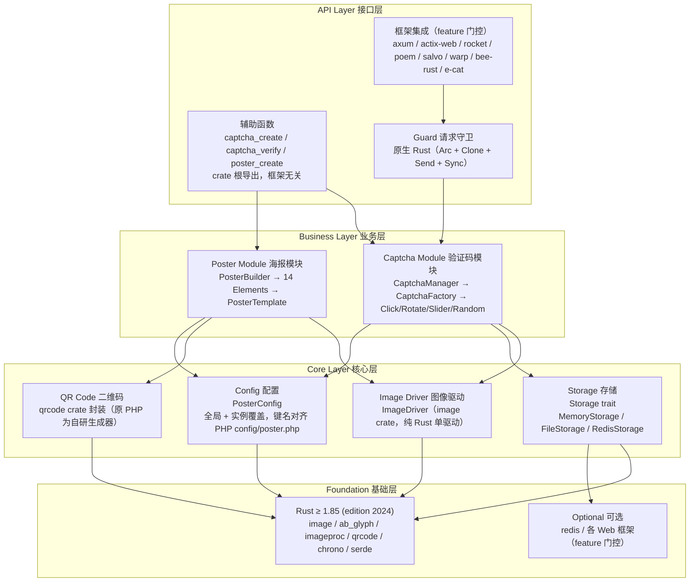
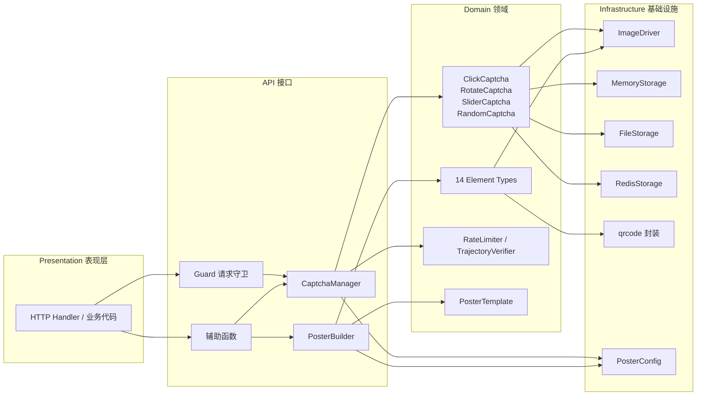
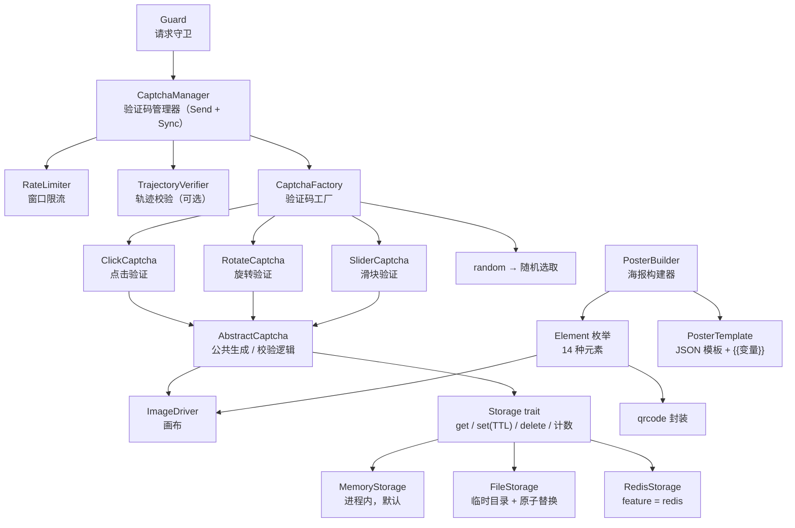
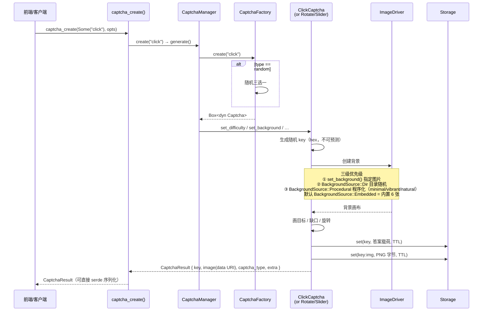
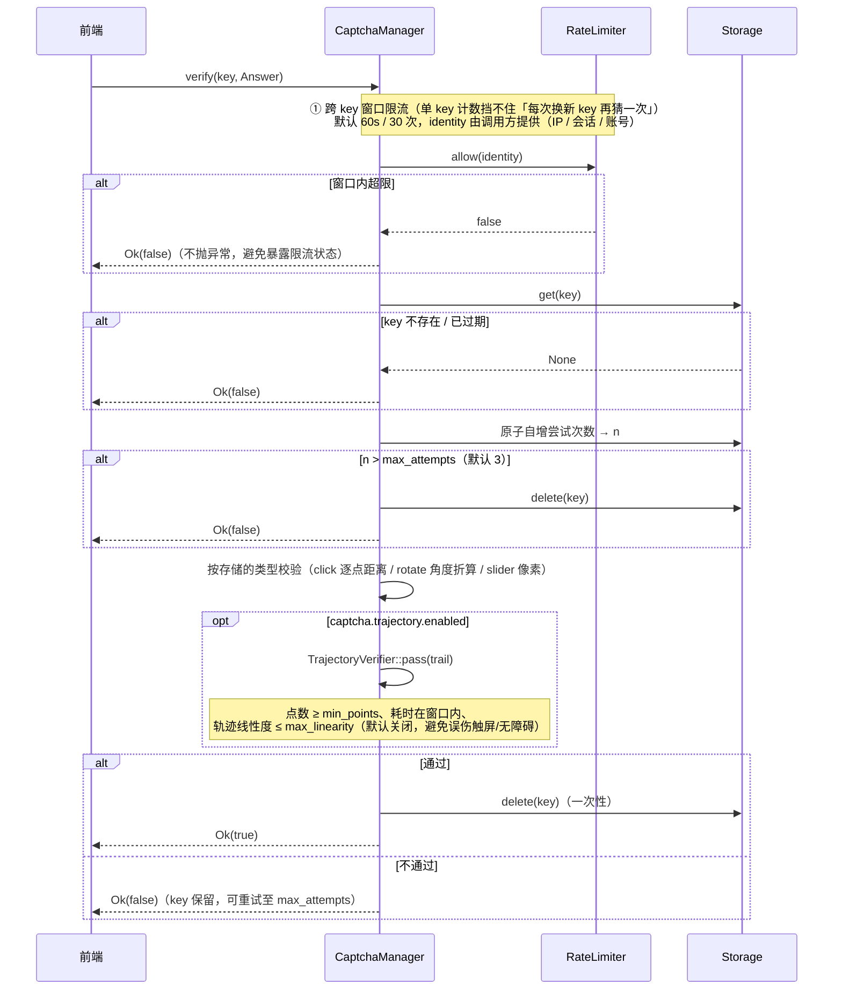
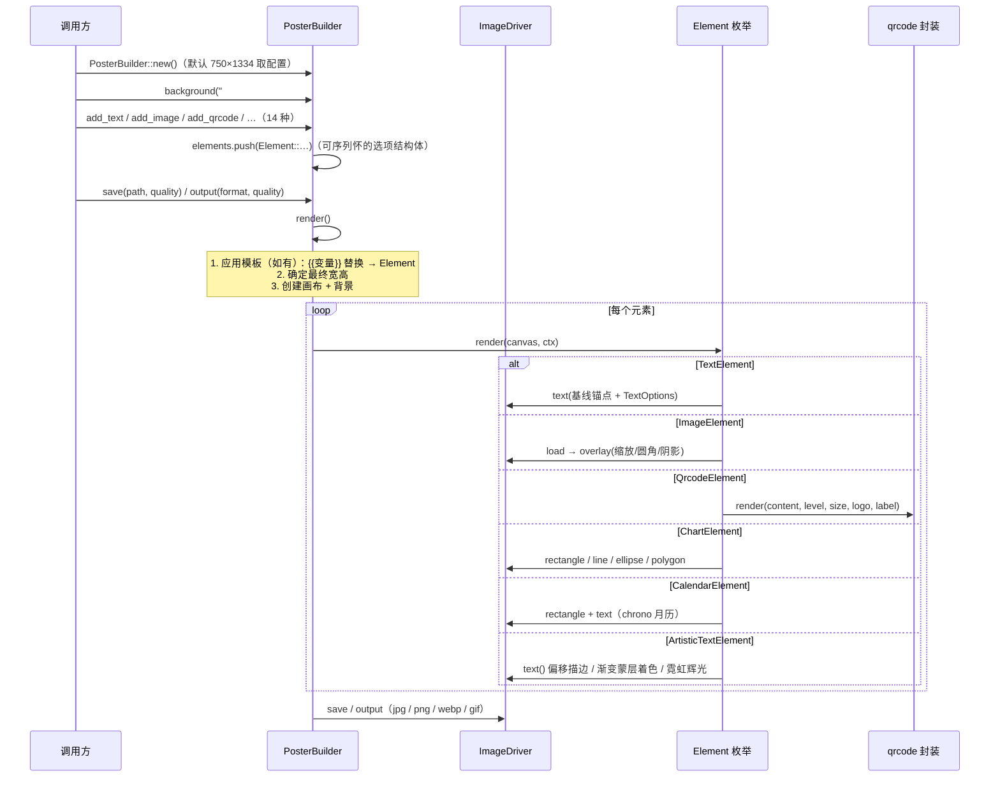
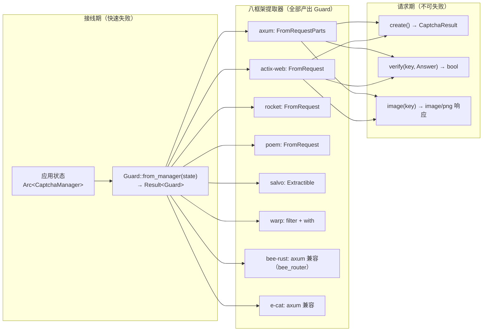
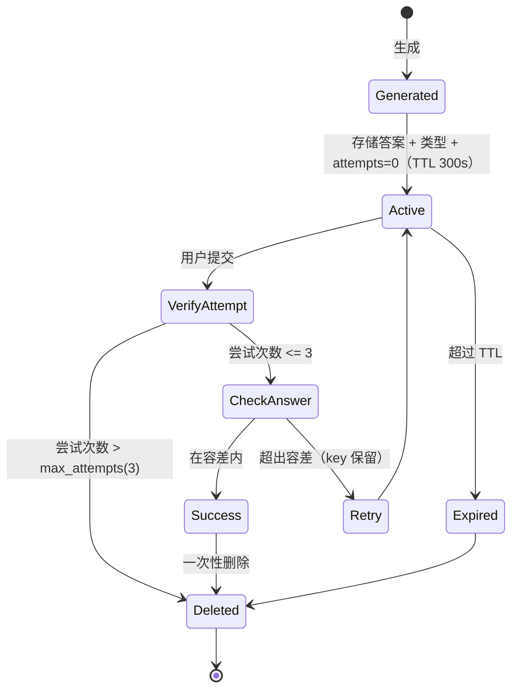
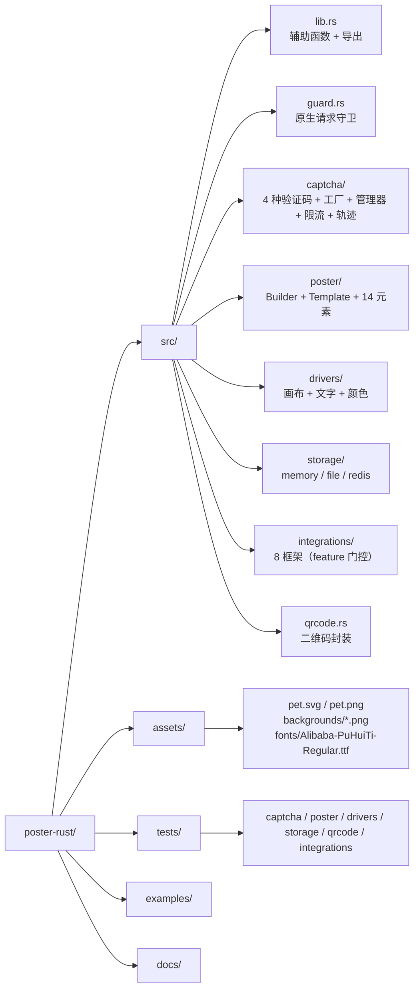

# poster-rust 架构设计与业务逻辑图

> 所有图表使用 Mermaid 语法，GitHub / GitLab 原生渲染。
> 本文档由 PHP 版 `docs/architecture.md` 改写而来，模块与驱动替换为 Rust 侧实现。

---

## 一、系统架构总览

---

## 二、分层依赖关系

---

## 三、组件关系图

---

## 四、验证码生成流程

### 4.1 凹凸拼图轮廓（SliderCaptcha jigsaw）

`slider_shape = "jigsaw"` 时，缺口与拼图块共用同一套多边形轮廓：

- **轮廓生成** — 4 段边线 + 4 个半径 `k = 短边 / 5` 的半圆（圆心在各边中点，12 段采样），凸/凹逐边随机，共 16 种组合
- **两个画布原语** — `polygon()`（任意多边形填充，自动闭合）与 `mask()`（掩膜裁剪：掩膜透明度过半处目标像素置空）
- **像素级对齐不变量** — 缺口（多边形填充）与拼图块（掩膜裁剪）覆盖范围逐像素相等（有单测钉死）；拼图块 PNG 是外扩 `k` 后的外接矩形，服务端答案 x/y = PNG 左上角
- **边距保证** — 凸出不贴边、不越界（最小画布检查保证）

---

## 五、验证码验证流程

---

## 六、海报生成流程

---

## 七、请求守卫与框架集成

---

## 八、安全模型

安全特性：一次性 key、防暴力（3 次）、有效期（300s）、跨 key 窗口限流（60s/30 次）、可选轨迹校验、随机背景与目标位置（防 OCR/枚举）、原子尝试计数（防并发绕过）。

---

## 九、目录结构映射

---

> 以上图表可在支持 Mermaid 的 Markdown 渲染器中直接查看（GitHub / GitLab / VS Code / Typora）。
